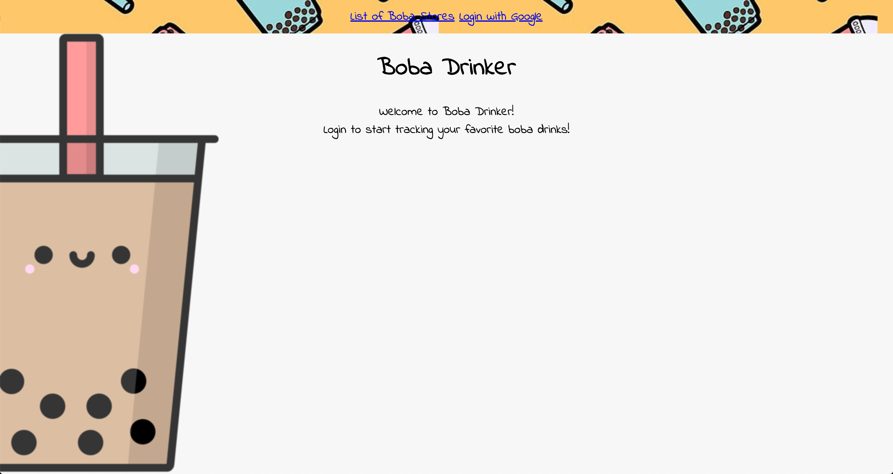
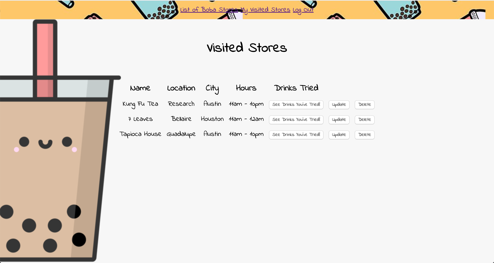
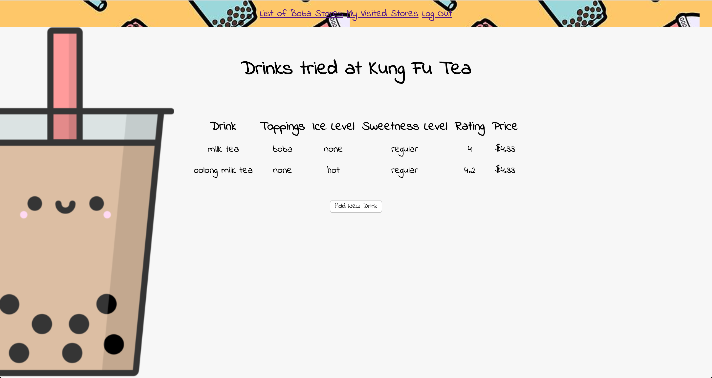

# Boba Drink Tracker

## Introduction:
With the popularity of boba drinks (also known as bubble tea or tapioca drinks) rising, addicts all around will need a tool to track which shops they've been to and which drinks they've already tried! Look no further than BobaDrinker!

## Check out the App:
[Check out Boba Drinker!](https://boba-drinker.herokuapp.com/) 

[Trello](https://trello.com/b/L4fEDwVi/boba-node-express-mdb) 

## View of the App:
Landing Page:

Visited Stores View:

Drinks for Each Store:

## Technologies Implemented:
JavaScript, CSS, HTML, Node.js, Express, MongoDB/Mongoose, Google OAuth

## Credits:
- Background Image by clipartkey: https://www.clipartkey.com/view/TimRox_cartoon-bubble-tea-transparent-background/
- Indie Flower font by Google Fonts
- Nav Bar background image by evannave: https://www.redbubble.com/people/evannave/shop?ref=artist_title_name

# User Experience:
## User Persona #1:
Michael is a long-time boba addict. He recently paid the hospital a visit due to too many boba balls laying undigested in his system. Luckily, having tracked all drinks he's tried, Michael was able to provide the doctors with vital information to save his life! He is looking forward to being able to drink new boba teas again!

## User Persona #2:
Crystal just moved to Austin, Texas. She is intrigued with the possiblity of mixing herbs with boba drinks to provide health benefits. In order to do more research, she needs to visit different boba shops and track the drinks she's tried. Crystal stumbled upon Boba Drinker and has been using it for the past 2 years to track each boba tea in the city!

## Next Steps:
- Add personal profile page
- Allow users to add reviews to each store
- Show a page with compiled list of all drinks tried
- Include a "drinks to try later" page
- Include a maps API to allow searching for boba store locations
- Add page to store personal boba recipes
- Add mobile responsiveness
